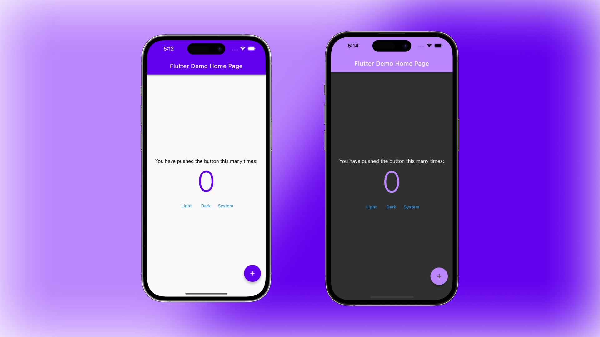

# Flutter Custom App Theme with ThemeExtension (Example + Template)

This is a simple Flutter custom theme example with [ThemeExtension](https://api.flutter.dev/flutter/material/ThemeExtension-class.html) for custom colors and text styles.

⭐️ **[Article on Medium](https://medium.com/@alexandersnotes/flutter-custom-theme-with-themeextension-792034106abc)**

## Files navigation

[app_theme.dart](lib/app_theme.dart) - simple `AppTheme` **template** with `ChangeNotifier` for changing `ThemeMode` and `ThemeExtension` for custom colors.

[app_colors_extension.dart](lib/app_colors_extension.dart) - **template** for custom colors extension ([GitHub Gist](https://gist.github.com/SashaKryzh/d353d19b84ddf679862b9aa9cd9d31c0)).

[app_text_theme_extension.dart](lib/app_text_theme_extension.dart) - **template** on how to define custom text theme extension ([GitHub Gist](https://gist.github.com/SashaKryzh/5b7eb45226dfb7ec521f7e1634c85dfc)).

[app_palette.dart](lib/app_palette.dart) - **example** on how to define custom color palette with 2 approaches to group colors.

[app_typography.dart](lib/app_typography.dart) - **example** on how to define custom typography.

[main.dart](lib/main.dart) - usage **example**.

---

Flutter version: 3.10.1
